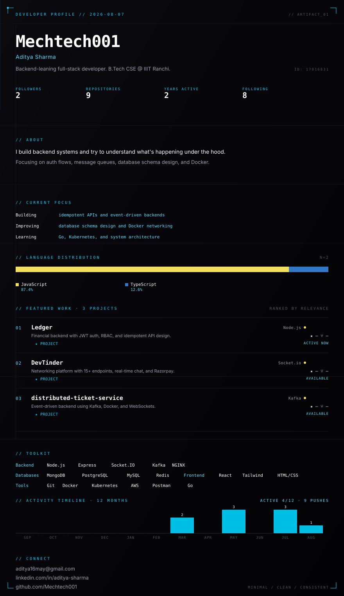

<!-- ░▒▓ SYNAPTIC CODE — synapticcode.dev ▓▒░ -->
<!-- Two files: profile.svg + this README.md → commit both to repo named "Mechtech001" -->

<div align="center">

</div>

<br/>

<div align="center">


[](https://github.com/Mechtech001?tab=followers)


</div>

---

## ◈ Identity

```yaml
# @Mechtech001 ──────────────────────────────────────────────
  role         : "Student Developer · Open Source"
  location     : "Remote / Global"
  bio          : ""
  public_repos : 9
  followers    : 2
  following    : 8
  stack        : [JavaScript, TypeScript]
# ────────────────────────────────────────────────────────
```

---

## ◈ About

Pushing code, learning in the open, and contributing to projects that matter. Current focus: JavaScript · TypeScript. All metrics below update live from GitHub.

---

## ◈ Stack

<div align="center">

 

</div>

---

## ◈ GitHub Intelligence

<div align="center">


</div>

---

## ◈ Featured Work

<details>
<summary><strong>Car_Vista</strong> &nbsp;·&nbsp; <code>JavaScript</code> &nbsp;·&nbsp; ⭐ 0 &nbsp;·&nbsp; 🍴 0</summary>
<br/>

> Open-source — documented through code and commit history.

[](https://github.com/Mechtech001/Car_Vista)

</details>

<details>
<summary><strong>DevTinder</strong> &nbsp;·&nbsp; <code>JavaScript</code> &nbsp;·&nbsp; ⭐ 0 &nbsp;·&nbsp; 🍴 0</summary>
<br/>

> Open-source — documented through code and commit history.

[](https://github.com/Mechtech001/DevTinder)

</details>

<details>
<summary><strong>Mechtech001</strong> &nbsp;·&nbsp; <code>Multi-stack</code> &nbsp;·&nbsp; ⭐ 0 &nbsp;·&nbsp; 🍴 0</summary>
<br/>

> Open-source — documented through code and commit history.

[](https://github.com/Mechtech001/Mechtech001)

</details>

<details>
<summary><strong>Ledger</strong> &nbsp;·&nbsp; <code>JavaScript</code> &nbsp;·&nbsp; ⭐ 0 &nbsp;·&nbsp; 🍴 0</summary>
<br/>

> Financial transaction system and secure backend processing transactions across 8 database models with JWT auth and RBAC for 3 user roles.

[](https://github.com/Mechtech001/Ledger)

</details>

---

## ◈ Connect

<div align="center">

[](https://github.com/Mechtech001)

</div>

---

<div align="center">
<sub>⚡ synapticcode.dev · profile auto-generated · stats live on every visit</sub>
</div>
